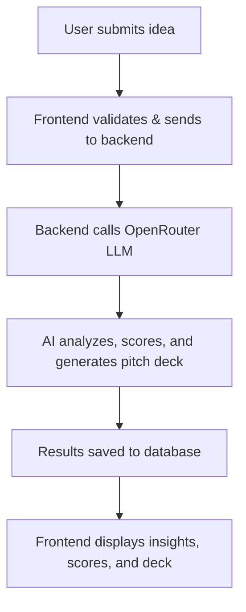

<details>
<summary>Project Architecture & Decisions (click to expand)</summary>

# StartupDeck AI - Business Validation & Pitch Generation Platform

## Overview

This is a comprehensive full-stack web application that provides AI-powered business idea validation, market analysis, and pitch deck generation using self-hosted open-source LLMs. The platform offers StartupDeck-like functionality with enhanced business validation features, professional UI design, and complete privacy through local Ollama models.

## User Preferences

Preferred communication style: Simple, everyday language.

## Recent Changes (January 2025)

### Major Feature Enhancements
- **Business Validation Engine**: Added comprehensive business idea analysis with scoring system (0-100)
- **Multi-Page Architecture**: Implemented `/analyze` and `/result` pages for enhanced user flow
- **Advanced Analytics**: TAM/SAM/SOM calculations, target audience analysis, competition research
- **Professional UI Redesign**: Modern gradient design, improved typography, and responsive layout
- **SWOT Analysis**: Automated strengths, weaknesses, opportunities, and threats evaluation
- **Recommendation System**: AI-powered go/wait/pivot recommendations with confidence scoring
- **Database Integration**: Replaced memory storage with PostgreSQL database for persistent data storage
- **Freemium Authentication System**: Implemented usage tracking and authentication with tiered access
- **Midnight Blue Color Palette**: Applied cohesive midnight blue theme (#145da0, #0c2d48, #2e8bc0, #b1d4e0) across entire application

### Enhanced Authentication & UI/UX System
- **Modern Authentication Flow**: Beautiful enhanced auth modal with Freepik-inspired gradient backgrounds and OAuth integration UI
- **Anonymous Users**: 1 free business validation and pitch deck generation
- **Free Accounts**: 5 validations and 3 pitch decks per month after sign-up
- **OAuth Integration**: Google, GitHub, and Twitter OAuth provider UI with "coming soon" backend preparation
- **Usage Tracking**: Browser localStorage for anonymous users, database for authenticated users
- **Session Management**: Simple session-based authentication with secure tokens
- **Animated UI Elements**: Custom CSS animations, floating elements, gradient shifts, and modern transitions
- **Landing Page**: Professional marketing page with pricing tiers, feature highlights, and call-to-action sections
- **Smart Routing**: Authentication-based routing showing landing page for anonymous users, home for authenticated users
- **UI Integration**: Authentication modals, usage indicators, and user status in header
- **Graceful Limits**: Clear messaging when limits are reached, prompting sign-up

## System Architecture

### Frontend Architecture
- **Framework**: React 18 with TypeScript
- **Bundler**: Vite for development and build processes
- **UI Framework**: shadcn/ui component library built on Radix UI primitives
- **Styling**: Tailwind CSS with CSS custom properties for theming
- **State Management**: React Query (@tanstack/react-query) for server state
- **Routing**: Wouter for lightweight client-side routing
- **Forms**: React Hook Form with Zod validation

### Backend Architecture
- **Runtime**: Node.js with ES modules
- **Framework**: Express.js for HTTP server
- **AI Integration**: Ollama for local LLM inference
- **Data Storage**: PostgreSQL database with Drizzle ORM (fallback to MemStorage for development)
- **Authentication**: Session-based auth with in-memory session store and database user management
- **Usage Tracking**: Database storage for user limits and usage counts
- **Development**: tsx for TypeScript execution in development

## Key Components

### Data Layer
- **Schema Definition**: Shared TypeScript schemas using Drizzle ORM and Zod
- **Database**: PostgreSQL with Drizzle ORM for production data persistence
- **Storage Interface**: Abstract storage interface allowing swappable implementations
- **User Management**: Users table with tier-based usage tracking (validationsUsed, pitchDecksUsed)
- **Usage Tracking**: Client-side localStorage for anonymous users, database for authenticated users

### Frontend Components
- **PitchDeckGenerator**: Main form component for creating pitch decks
- **PitchDeckDisplay**: Component for rendering generated pitch decks
- **SettingsModal**: Configuration interface for Ollama settings
- **UI Components**: Comprehensive set of shadcn/ui components

### Backend Services
- **Ollama Integration**: Direct communication with local Ollama instance
- **Pitch Deck Generation**: AI-powered content generation with structured prompts
- **API Routes**: RESTful endpoints for deck generation and status checking

## Data Flow

1. **User Input**: User enters a problem/keyword through the PitchDeckGenerator form
2. **Validation**: Frontend validates input using Zod schemas
3. **API Request**: React Query sends validated data to Express backend
4. **AI Processing**: Backend communicates with Ollama to generate pitch deck content
5. **Storage**: Generated deck is stored in memory (with option for database persistence)
6. **Response**: Structured pitch deck data is returned to frontend
7. **Display**: PitchDeckDisplay component renders the generated content
8. **Local Storage**: Frontend optionally saves decks to browser localStorage

## External Dependencies

### AI Services
- **Ollama**: Local LLM service running on localhost:11434
- **Models**: Supports various models (default: llama3.2)
- **Fallback**: Graceful handling when Ollama service is unavailable

### Database (Configured)
- **Neon Database**: PostgreSQL provider using @neondatabase/serverless
- **Drizzle ORM**: Type-safe database operations
- **Migration Support**: Database schema versioning with drizzle-kit

### UI Libraries
- **Radix UI**: Unstyled, accessible component primitives
- **Lucide React**: Icon library
- **Tailwind CSS**: Utility-first CSS framework

## Deployment Strategy

### Development
- **Vite Dev Server**: Hot module replacement for frontend
- **Express Server**: Backend API with middleware integration
- **tsx**: Direct TypeScript execution for development

### Production Build
- **Frontend**: Vite builds optimized static assets to `dist/public`
- **Backend**: esbuild bundles server code to `dist/index.js`
- **Static Serving**: Express serves built frontend assets in production

### Environment Configuration
- **Database URL**: PostgreSQL connection via DATABASE_URL environment variable
- **Ollama Host**: Configurable Ollama endpoint (default: localhost:11434)
- **NODE_ENV**: Environment-specific behavior switching

### Architectural Decisions

**Problem**: Need for local AI processing without external dependencies
**Solution**: Integration with Ollama for local LLM inference
**Rationale**: Provides privacy, cost control, and offline capability while maintaining high-quality AI generation

**Problem**: Complex UI requirements with consistent design
**Solution**: shadcn/ui component library with Tailwind CSS
**Rationale**: Provides professional, accessible components with customizable theming and responsive design

**Problem**: Type safety across frontend and backend
**Solution**: Shared TypeScript schemas using Zod and Drizzle
**Rationale**: Ensures data consistency, reduces runtime errors, and improves developer experience

**Problem**: Scalable data persistence with development flexibility
**Solution**: Abstract storage interface with memory and database implementations
**Rationale**: Allows rapid development with in-memory storage while providing path to production database persistence

</details>

# 🚀 **StartupDeckAI**

<p align="center">
  
</p>

<p align="center">
  <b>AI-powered platform for instant startup validation</b>
</p>

<p align="center">
  
  
  
  
  
  
</p>

---

## ✨ **What is StartupDeckAI?**

**StartupDeckAI** is your AI co-founder for startup validation. Instantly analyze your business idea, get market insights, MVP suggestions, and generate a pitch deck—all powered by open-source LLMs. Perfect for creators, students, and indie hackers who want to move fast and impress investors.

---

## 💡 **Why StartupDeckAI?**

- **Save weeks of research:** Get actionable feedback, market data, and pitch materials in minutes.
- **Investor-grade output:** Generate professional pitch decks and validation reports.
- **No vendor lock-in:** 100% open-source, self-hosted, and privacy-first.
- **Empower everyone:** From solo founders to student teams, validate ideas with confidence.

---

## 🌟 **Features**

| 🚀 | **Instant Validation**: Get a viability score and actionable feedback in seconds |
|----|---------------------------------------------------------------------------------|
| 📊 | **Market Insights**: TAM/SAM/SOM, competitor analysis, and target audience         |
| 🛠️ | **MVP Ideas**: AI-generated MVP suggestions and tech stack recommendations        |
| 🎤 | **AI Pitch Deck**: One-click, investor-ready pitch deck generation                |
| 🔒 | **Privacy-First**: All processing is local or via your own OpenRouter key         |
| 🦄 | **Modern UI/UX**: Beautiful, responsive, and easy to use                         |
| 🧑‍💼 | **User Tiers**: Anonymous, free, and pro accounts with usage tracking           |
| 🌐 | **OAuth Ready**: Google, GitHub, Twitter (UI complete, backend coming soon)       |
| 📈 | **Usage Analytics**: Track validations and pitch deck generations                 |

---

## 👤 **Who is it for?**

- **🚀 Indie Hackers:** Validate and pitch new SaaS ideas before you code.
- **🎓 Students:** Ace entrepreneurship projects with real market data and pro decks.
- **🦸‍♀️ Creators:** Test product-market fit for your next big thing.
- **💼 Startup Teams:** Align on vision, market, and execution with AI-powered clarity.
- **🧑‍💻 Developers:** Build, fork, and extend a modern AI SaaS stack.

---

## 🛣️ **Roadmap**

- [x] AI-powered business validation & scoring
- [x] Automated pitch deck generation
- [x] Market, competitor, and audience analysis
- [x] Freemium authentication & usage tracking
- [x] Modern, responsive UI (shadcn/ui, Tailwind)
- [ ] Team collaboration (MVP)
- [ ] PDF export & sharing
- [ ] More LLM model options (OpenRouter, HuggingFace, etc.)
- [ ] Real-time feedback & chat (PitchGPT mode)
- [ ] More integrations (Notion, Slack, etc.)

---

## 🖼️ **Screenshots & Demo**

<p align="center">
  
  <br/>
  <em>✨ Replace with your own animated GIFs/screenshots for maximum wow! ✨</em>
</p>

---

## 🧑‍💻 **Tech Stack**

| Frontend   | Backend   | Database   | AI/LLM         | Styling      |
|------------|-----------|------------|----------------|--------------|
| Next.js    | Node.js   | Supabase   | OpenRouter/DeepSeek | Tailwind CSS |
| React      | Express   | PostgreSQL | (or any OpenRouter model) | shadcn/ui    |

---

## 🛠️ **How it Works**



---

## 📦 **Example Use Cases**

- **"I want to know if my app idea is worth building."**
- **"I need a pitch deck for my hackathon project—fast!"**
- **"Our student team needs market data for a business plan."**
- **"I want to impress investors with a data-driven, AI-generated deck."**
- **"I want to fork and build my own AI SaaS platform."**

---

## 🗣️ **Testimonials**

> "StartupDeckAI gave me a full market analysis and pitch deck in 2 minutes. I used it to win my university's startup competition!"  
> <sub>— Alex, Student Founder</sub>

> "I use StartupDeckAI to validate every new SaaS idea before I write a single line of code. It's my secret weapon."  
> <sub>— Priya, Indie Hacker</sub>

---

## 📝 **FAQ**

**Q: Is my data private?**  
A: Yes! All processing is local or via your own OpenRouter key. No data is shared with third parties.

**Q: Can I use my own LLM or API?**  
A: Yes! The backend is modular—swap in any OpenRouter-compatible model.

**Q: Is it really free?**  
A: 100% open-source (MIT). You can self-host, fork, and extend as you wish.

**Q: Can I export my pitch deck?**  
A: PDF export and sharing are on the roadmap!

**Q: How do I contribute?**  
A: See the [Contributing](#-contributing) section below.

---

## ⚡ **Quick Start**

```bash
# 1. Clone the repo
$ git clone https://github.com/trynayash/startupdeckai.git
$ cd startupdeckai

# 2. Install dependencies
$ npm install

# 3. Set up environment variables
$ cp .env.example .env
# Fill in your DATABASE_URL and OPENROUTER_API_KEY

# 4. Run the app
$ npm run dev
```

- Frontend: http://localhost:5173
- Backend: http://localhost:3000

---

## 🌐 **Live Demo**

> [🚀 Try StartupDeckAI Live](#) <!-- Replace with your live link -->

---

## 🤝 **Contributing**

We love contributions! To get started:

1. Fork this repo
2. Create a feature branch (`git checkout -b feature/your-feature`)
3. Commit your changes
4. Push and open a PR

**Ways to contribute:**
- Add new features or integrations
- Improve UI/UX or documentation
- Report bugs or suggest enhancements
- Share your use case or testimonial

Please see [CONTRIBUTING.md](CONTRIBUTING.md) for more details.

---

## 📄 **License**

MIT — free for personal and commercial use.

---

## 📬 **Contact & Credits**

- GitHub: [trynayash/startupdeckai](https://github.com/trynayash/startupdeckai)
- LinkedIn: [Nayash on LinkedIn](https://www.linkedin.com/in/your-linkedin/) <!-- Replace with your LinkedIn -->
- Built by [@trynayash](https://github.com/trynayash) and open-source contributors

---

<p align="center">
  
</p> 

